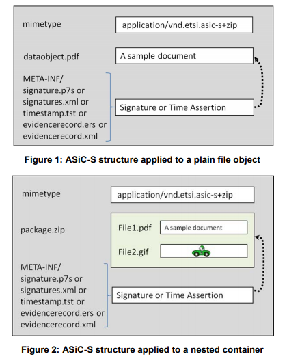

---
tags:
	- ASIC
	- Associated
	- Signature
	- Containers
---

# Associated Signature Containers (ASiC)
> Specifies the use of container structures to bind together one or more signed objects with either advanced electronic signtatures or timestamp tokens into one single container based on ZIP.
### Introduction
When signing data, the resultant signature needs to be associated with the data to which it applies. This is usually done by enveloping the data with the signature, including a signature element within the dataset, or placing the detached signature in a separate resource.

The ASiC is a data container holding a set of file objects and associated digital signatures or time assertions using ZIP format.

Definitions:
- **Container:** File created according to ZIP, holding as internal elements files with related manifest, metadata, and associated signatures under a folder heirarchy.
- **Time Assertion:** Timestamp token or evidence record. Can be used as proof of existence and integrity in signature validation.

## ASiC-Simple (ASiC-S)

In ASiC-S, one single file object is associated with either one signature file or one time assertion file. 

```
├── ASiC Container
|   ├── Root/ 
|   |	├── META-INF/
|   |	|	├── signature.p7s
|   |	├── file.txt
|   |	├── mimetype
```

The file object can itself be a regular old file or possibly a container (ZIP, ASiC, Open Container Format, or Open Document Format), meaning that inner container is associated with a detached signature or time assertion that applies to it.

Signatures and time assertions within ASiC containers are present within signature or time assertion files. A signature file can contain one CAdES object; or one or more XAdES signatures. A time assertion file can contain one timestamp token according to [RFC 3161](), [EN 319]() or one Evidence Record conformant to [RFC 4998]() or [RFC 6283]().

If a `mimetype` file is defined, most of the time the contents of the file will be ...
```
application/vnd.etsi.asic-s+zip
```
Unless no extension is specified on the ASiC container and no media type is associated to the signed file object. In which case the mimetype should be the media type to associate to the signed file object. 



In summary, the container:
- May contain a `mimetype` file
- **Shall contain one data file at the root level**
- Shall contain one `META-INF` folder at the root level. `META-INF` shall contain only one of the following:
	+ `timestamp.tst`
	+ `signature.p7s`  (CAdES)
	+ `signatures.xml` (XAdES)
	+ `evidencerecord.ers`
	+ `evidencerecord.xml`
- `META-INF` may additionally contain:
	+ One or more `ASiCArchiveManifest` and the timestamp tokens that apply to them.
	+ Revocation status information
	+ Certificates referenced by CAdES Extended signatures or XAdES Extended signatures
	+ Other application-specific information