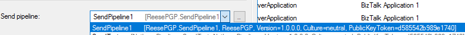

---
tags:
	- BIZTALK
	- Adapters
	- Pipeline
	- Components
---
# BizTalk Server
> BizTalk Server is a publish and subscribe architecture that uses adapters to receive and send messages, implement business processes through orchestrations, and includes management and tracking of the different parts. 

The BizTalk Server Engine has two main parts:

### Messaging Component
Provides the ability to communicate with a range of other software by relying on adapters for different kinds of communication. Support for creating and running graphically-defined processes called orchestrations. 

### Miscellaneous Component
A business rule engine that evalues a complex set of rules, a group hub that lets developers and administrators monitor and manage the engine and orchestrations it runs, and an SSO facility that provides the ability to map authentication information between Windows and non-Windows systems.

Other structural definitions for BizTalk: 

### Artifacts

Artifacts include the assemblies, certificates, business rules policies, BAM configuration files, bindings, and so forth that are necessary for a BizTalk applicatino to function. 

### Hosts

A host object in BizTalk represents a collection of runtime processes. It is basically a logical container to which you can add physical BizTalk Servers (host instances) and deploy items such as adapters, receive locations, and orchestrations.

### Host Instances

A host instance is the physical container for a BizTalk Server object where the message processing, receiving, and transmitting occurs. Multiple host instances can exist on a server when load balancing or for failover.

## The BizTalk Server Messaging Engine

Enables users to create business processes that span multiple applications. 


* A message is received into BSME through a **receive adapter**.
* A message is then processed through a **receive pipeline**.
* The message is delivered into a database called **MessageBox** which uses SQL Server.
* When a message arrives in the **MessageBox** that message is dispatched to its target **orchestration**. 
	* The result of this processing is likely another message produced by the orchestration and saved in the MessageBox.
* The message is then processed by a **send pipeline**
* The message is sent out using a **send adapter**

Another helpful visualization:


## Send Adapters and Receive Adapters

Send adapters are responsible for sending a BizTalk message to the specified endpoint using its specific transport protocol. 

Receive adapters are responsible for creating a new BizTalk Server message by attaching the network/data source stream to the message body and submitting it to the Messaging Engine (which in turn, handles passing the message along to the receive pipeline). The adapter deletes the data from the receive endpoint or sends the appropriate acknowledgement message to the client indicating the data has been accepted.

### More detail about BizTalk Messaging

1. Data is received through a receive location that is listening for messages of a certain protocol at a specified address. 
	+ The receive location is associated with an adapter and a receive pipeline. 
2. After the message is received by the receive location it is sent to the adapter which creates a new BizTalk message and submits it to the messaging engine.
3. The Messaging Enging sends the message to the receive pipeline where data is transformed.
4. The Messaging Engine publishes the message to the Message Box
5. The Messaging Enging sends the message to either an orchestration or a subscriber. Send ports can use a filter to subscribe to the Message Box.
	+ If an orchestration is the subscriber, it processes the message and then sends it out using a Send Port


## Send Ports and Receive Ports


A receive location is a particular address at which inbound messages arrive and should be passed along to the messaging pipeline (a one-way receive location). It can also function as a request-response receive location. 

```
nathand: from what I gather a request response receive location 
is a receive location that polls, does something, then puts a message in 
the Message Box. Then it pulls a message out of the MB and does something again, 
then puts a final message in the MB
```

A receive port is a logical grouping of receive locations. 

A send port is the location to which BizTalk Server sends messages. It can function as a one-way port that only sends messages or a solicit-response send port that can send a message out and then put a message back into the Message Box.

## Filters

You can use filters to create simple messaging applications or content-based routing applications. The filters tab in the Send Port properties allows you to define filter expressions for message properties or fields that determine which messages are routed to the send port. 


## Developing Custom Pipeline Components

Pipeline Designer is a graphical editor, hosted in Visual Studio which enables you to create new pipelines; view the pipeline templates included with BizTalk Server; move pipeline components within a pipeline; and configure pipelines, stages, and pipeline components.

1. Create a new `Empty BizTalk Server Project` in Visual Studio
2. Name it what you want the assembly to be named in the Pipeline Dropdown Menu in the Adapters (The first element in the square brackets).
	
3. Add a `New Item...` and name the pipeline component.
4. Configure the pipline component.
5. `Build` and `Deploy` the component to BizTalk Server. The component is added to the default application under "Pipelines". You might need to refresh.

Microsoft and other third-party companies that make BizTalk adapters also install pre-built pipeline components to BizTalk Server. Those are the ones that already appear in the Pipeline Dropdown Menu present in adapter configuration pages. They have just been built and deployed ahead of time so the developer does not have to.